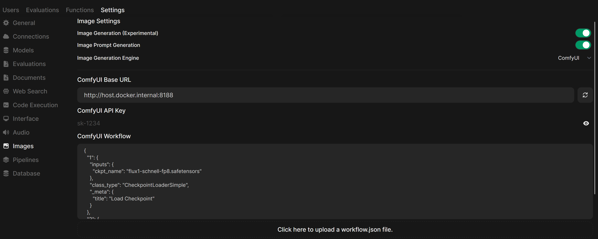
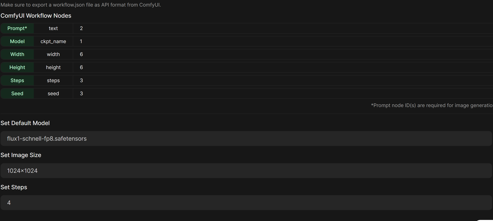

# LocalAI

My LocalAI setup (currently more a scratchpad, than something comprehensive)

## OpenWebUI

Great frontend for LLM, Text-To-Speech, HTML scratching, etc. Can be easily run as a docker container.

Docker run for just running OpenWebUI (no ollama):
```
docker run -d -p 3000:8080 --add-host=host.docker.internal:host-gateway -v open-webui:/app/backend/data --name open-webui --restart always ghcr.io/open-webui/open-webui:main
```

For actually running the LLMs, I found [ollama](https://ollama.com/) extremely useful. Good selection of models, fine-tuning can be done, and also easy-to-use. For performance reason, I use the installed version (no docker).

## ComfyUI

Node-based generative AI tool, to generate images, videos, etc.

[ComfyUI](https://www.comfy.org/)

[ComfyUI Wiki](https://comfyui-wiki.com/en)

I currently just use text2img, and I'm using the [FLUX1 schnell](https://huggingface.co/black-forest-labs/FLUX.1-schnell) model (Apache2, commercial viable). The one I have configured is that [FP8 workflow](comfyui_workflows/FluxSchnell_fp8_API.json) based on [ComfyUI FP8 workflow](https://comfyui-wiki.com/en/tutorial/advanced/flux1-comfyui-guide-workflow-and-examples#comfy-org-fp8-checkpoint-version). Does not need as much RAM and VRAM as the full model. In my case the RAM was the limit.

For easily running in docker, I use [lecode-offical/comfyui-docker](https://github.com/lecode-official/comfyui-docker). For actually creating the workflow and play with it, I use the desktop installation of ComfyUI.

```
docker run --name comfyui --detach --restart unless-stopped --volume "<path/to/models/folder>:/opt/comfyui/models:rw" --volume "<path/to/custom/nodes/folder>:/opt/comfyui/custom_nodes:rw" --publish 8188:8188 --runtime nvidia --gpus all ghcr.io/lecode-official/comfyui-docker:latest
```

My OpenWebUI settings to connect ComfyUI:


